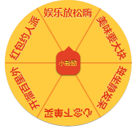

# wechat-taroturntable
基于 [Taro](https://taro.jd.com/) 的微信小程序抽奖转盘



本组件的思路源自[“用微信小程序开发的Canvas绘制可配置的转盘抽奖”](https://github.com/givebest/wechat-turntalbe-canvas).

组件基于 React 语法改写和 Scss 样式设定，发布于 [Taro](https://taro.jd.com/) 的[物料市场](https://taro-ext.jd.com/)，以便在 [Taro](https://taro.jd.com/) 中直接使用.

```javascript
//引入组件
import Luckyturntable from 'wechat-taroturntable'

//定义抽奖内容
//commentIcon 是 Taro 的 Icon 名称，缺省值是 sketch (钻石图标)
const awardsList = [
  {id:1, award:'娱乐放松嗨', comment: '电影要去影院看，飙歌要去包间喊！', commentIcon: 'sound'},
  {id:2, award:'美味要大块', comment: '垂涎直下三千尺，享用美食在眼前。', commentIcon: 'heart'},
  {id:3, award:'独坐静发呆', comment: '放空一段自己自由自我的午后，静静品味岁月静好。', commentIcon: 'user'},
  {id:4, award:'心念下单买', comment: '终于为心心念念的消费找到一个充分必要的理由！', commentIcon: 'shopping-cart'},
  {id:5, award:'开溜百里外', comment: '背上包，说走就走。多久没有出游玩一趟了？', commentIcon: 'image'},
  {id:6, award:'红包约人派', comment: '朝某人振臂一呼，小小激励速速！且行且珍惜.'}
];

```

```jsx
//render 中直接设置使用
//buttonTitle 缺省值是'小激励'
<Luckyturntable awards={awardsList} buttonTitle='小鼓励' />
```

---

Props

| 名称  | 类型 | 说明 |
| ---------- | ------------- | ------------- |
| awards  | 对象数组  | 奖项设置  |
| buttonTitle  | string  | 抽奖按钮的文字，默认值是“小激励”  |
